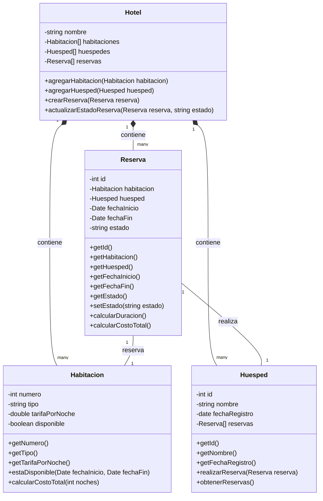

### **Diagrama UML**

```mermaid
classDiagram
    class Hotel {
        -string nombre
        -Habitacion[] habitaciones
        -Huesped[] huespedes
        -Reserva[] reservas
        +agregarHabitacion(Habitacion habitacion)
        +agregarHuesped(Huesped huesped)
        +crearReserva(Reserva reserva)
        +actualizarEstadoReserva(Reserva reserva, string estado)
    }

    class Habitacion {
        -int numero
        -string tipo
        -double tarifaPorNoche
        -boolean disponible
        +getNumero()
        +getTipo()
        +getTarifaPorNoche()
        +estaDisponible(Date fechaInicio, Date fechaFin)
        +calcularCostoTotal(int noches)
    }

    class Huesped {
        -int id
        -string nombre
        -date fechaRegistro
        -Reserva[] reservas
        +getId()
        +getNombre()
        +getFechaRegistro()
        +realizarReserva(Reserva reserva)
        +obtenerReservas()
    }

    class Reserva {
        -int id
        -Habitacion habitacion
        -Huesped huesped
        -Date fechaInicio
        -Date fechaFin
        -string estado
        +getId()
        +getHabitacion()
        +getHuesped()
        +getFechaInicio()
        +getFechaFin()
        +getEstado()
        +setEstado(string estado)
        +calcularDuracion()
        +calcularCostoTotal()
    }

    Hotel "1" *-- "many" Habitacion : contiene
    Hotel "1" *-- "many" Huesped : contiene
    Hotel "1" *-- "many" Reserva : contiene
    Reserva "1" -- "1" Habitacion : reserva
    Reserva "1" -- "1" Huesped : realiza
```
